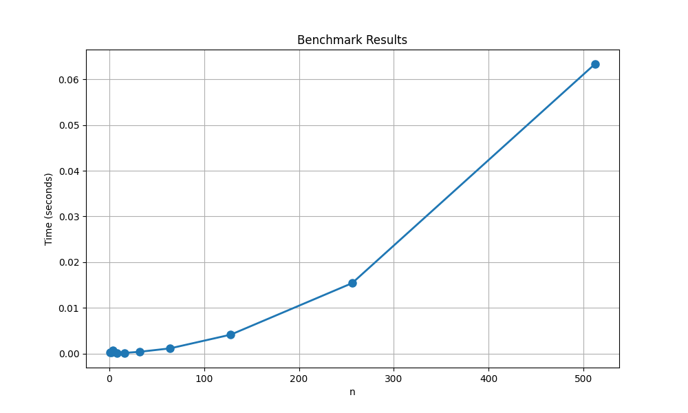

# Programming-Assignment-1 - Matching and Verifying

# Team
- Josh Caron, UFID = 40792496
- Joseph Molina, UFID = 37598582

# To compile/build the code
- No compliation or build step required. 
- Ensure Python3.x installed.

```bash
python3 --version
```

# To run the matcher

```bash
python3 src/main.py <input file path> <output file path>
```

# To run the matcher WITH verifier
```bash
python3 src/main.py <input file path> <output file path> --verify
```

# Assumptions

**Input:**
- File must contain exactly 2n+1 lines, where n is the number of hospitals/students. 
- Each preference list containes exactly n integers. 
- Prference lists are permutations of 1...n. 
- Preferences use 1-based indexing. 
- No empty lines or malformed data

**Output:**
- n lines, each containing "i j" where hospital i is matched to student j. 
- Verifier output prints "VALID STABLE" or fails with messages like "INVALID ___" or "UNSTABLE (blocking pair)". 

**Dependencies:**
- Python 3.x standard library only (no external packages required). 
- Standard libraries for file I/O and parsing.


# Graph and Solution to Task C


Both the matcher and the matcher + verifier times grow non-linearly with n; this matches the expected O(n^2) behaviour of Gale–Shapley (worst-case proposals ~ n^2). The verifier adds overhead but remains within the same complexity class.